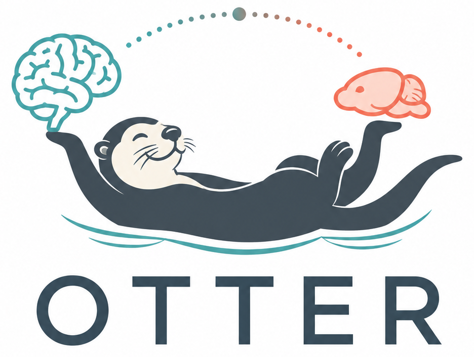

<p align="center">
  
</p>

# OTTER

**O**ptimal **T**ransport for **T**ranslation across **E**volutionary **R**elatives.

OTTER is a Python package for probabilistic mouse–human brain correspondence. It uses
semirelaxed fused Gromov–Wasserstein optimal transport to combine functional and structural
connectivity, spatial position and curated comparative anatomy.

The released coupling, `pi_canonical.npy`, has shape 1,864 mouse parcels × 2,094 human parcels.
An entry `pi[i, j]` is a transport weight between mouse parcel *i* and human parcel *j*; a row
becomes a distribution over human targets after row normalisation. OTTER can route mouse maps to
the human brain, rank mouse structures corresponding to human maps and quantify where human
connectivity is poorly reconstructed from mouse connectivity.

## Interactive explorer

The self-contained OTTER Mapping Explorer is bundled as [`docs/index.html`](docs/index.html).
Open the file locally for region and parcel queries, ranked human targets and the interface
metadata associated with each mouse parcel. It does not require Python or a backend.

## Installation

```bash
git clone https://github.com/peach-lucien/otter.git
cd otter
conda env create -f env.yml
conda activate otter
pip install -e ".[dev]"
pytest -q
python scripts/fetch_data.py
```

The test suite uses synthetic fixtures and can run before downloading the data. The default data
bundle is approximately 735 MB and contains the released couplings, processed parcel tables and
inputs needed by the notebooks and analyses.

## Quickstart

```python
import numpy as np
from otter.data import load_cached, load_pi

M, _ = load_cached("mouse", cache_dir="outputs/anndata")
H, _ = load_cached("human", cache_dir="outputs/anndata")
pi = load_pi()  # pi_canonical.npy; shape (1864, 2094)

# Distribution over human targets for one mouse parcel
mouse_idx = 1234
weights = pi[mouse_idx] / pi[mouse_idx].sum()
top = np.argsort(weights)[::-1][:5]

result = H.var.iloc[top][["region", "x", "y", "z"]].copy()
result["weight"] = weights[top]
print(result)
```

For region-level queries, map translation and interactive visualisation, start with
[`notebooks/01_quickstart.ipynb`](notebooks/01_quickstart.ipynb). Use `load_pi()` rather than
hard-coding a coupling filename; `pi_provenance()` returns the loaded file and its SHA-256 hash.

## Data

Large data and generated artefacts are distributed through Zenodo rather than Git:

- `python scripts/fetch_data.py` downloads the reproduce bundle used by the notebooks and analyses.
- `python scripts/fetch_data.py --tier raw` additionally downloads the inputs needed for a
  from-scratch rebuild.
- [`DATA.md`](DATA.md) lists the archive contents, provenance and third-party licensing constraints.

The version-independent data DOI is
[10.5281/zenodo.20733162](https://doi.org/10.5281/zenodo.20733162). The repository manifest pins the
exact archive version used by the release.

## Method in brief

OTTER aligns the two brains without requiring a shared parcel set or native coordinate frame. The
relational term compares within-species functional and structural connectivity. A cross-species
term combines an anchor-warped spatial cost with 21 Garin homology classes and 26 curated regional
correspondence entries. The mouse marginal is fixed and the human marginal is free, allowing some
human parcels to receive little transported mass.

The production recipe is exposed in [`src/otter/repro.py`](src/otter/repro.py). The
comparative-anatomy sources used for the regional packs are listed in
[`docs/04_anchor_packs.md`](docs/04_anchor_packs.md).

## Interpretation

- OTTER is anatomically supervised. It extends curated correspondence through connectivity and
  spatial structure; it does not discover homology without an anatomical frame.
- Regional correspondence is more stable than parcel-exact assignment. Fine-scale predictions
  should be interpreted with the relevant sensitivity analyses and anatomical metadata.
- The Beauchamp transcriptomic correspondences inform hyperparameter evaluation, and some
  benchmark territories overlap OTTER's anatomical scaffold. Target-wise supervision-withheld
  refits provide the stricter generalisation analysis.
- The explorer's display categories combine anchor or benchmark-region membership with internal
  stability summaries. They are heuristic interface metadata, not calibrated probabilities or
  estimates of parcel-level correctness.
- A translated map is a spatial hypothesis, not a human measurement. Predictions in territories
  with low mouse-based connectivity reconstruction warrant particular caution for connectional
  claims.

## Reproducibility and repository layout

```text
src/otter/       Python package: data, models, evaluation and visualisation
notebooks/       Quickstart, methodology and analysis walkthroughs
pipeline/        Data preparation and model-building scripts
experiments/     Analysis and sensitivity scripts
outputs/logs/    Machine-readable result logs with coupling provenance
docs/            Method documentation and the self-contained explorer
tests/           Unit tests using synthetic fixtures
```

Analyses read the released coupling or record the recipe of a refitted coupling; result logs
should be checked against their recorded coupling hash.

## Citation

Associated manuscript: *Probabilistic mouse–human brain correspondence by multimodal optimal
transport* (submitted). Full citation details will be added when available. Until then, please
cite the bioarxiv:
[10.64898/2026.08.24.746652v1](https://www.biorxiv.org/content/10.64898/2026.08.24.746652v1)
And archived data and software release using
[10.5281/zenodo.20733162](https://doi.org/10.5281/zenodo.20733162).

## Acknowledgements

OTTER was developed by the S01 project of the reTune Collaborative Research Centre, a
collaboration between Würzburg and Berlin. The project is led by Robert Peach, Phillip
Boehm-Sturm and Martin Reich, and first-authored by Stefan Koch, Mario Perales, Tanmoy Sil and Shawn Hiew.


## License

MIT. See [`LICENSE`](LICENSE).
